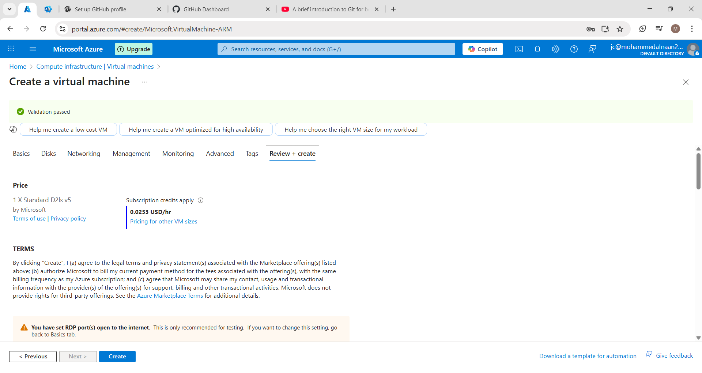

# Azure-Windows-VM-Project

## 📘 Overview
This project demonstrates how to create and access a Windows Virtual Machine (VM) using the Microsoft Azure Portal.

---

## 📸 Screenshots with Steps

### Step 1: Create the Virtual Machine  

### Step 2: Configure Size and Region  

### Step 3: Set Admin Username and Password  

### Step 4: Configure Networking (NSG Rules)  

### Step 5: Review + Create  

### Step 6: Deployment in Progress  

### Step 7: Connect via RDP  

---

## 🧰 Tools Used
- Azure Portal
- Virtual Machine (Windows 11)
- Networking and Public IP
- Remote Desktop Protocol (RDP)

## 🧠 Skills Gained
- VM provisioning in Azure
- Networking and NSG setup
- Public IP configuration
- Secure access using RDP

## 📅 Completion Date
July 2025

## 👤 Author
**Mohammed Afnaan**
